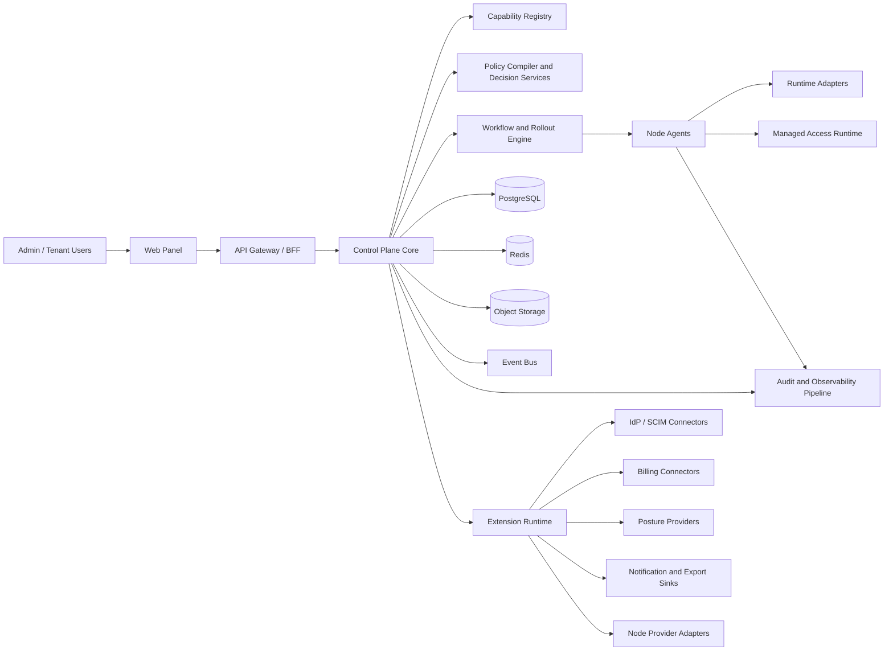

# 02. Architecture

## 2.1 System Context

## 2.2 Architectural Style

Use a modular monolith first, with explicit extension points and internal platform boundaries.

This is not a classic plugin free-for-all and not premature microservices.
It is a governed platform core with:

- domain modules inside the core
- a capability registry
- extension contracts
- isolated adapter runtimes where trust or lifecycle boundaries matter

## 2.3 Architecture Goals

- keep the core simple to deploy
- allow connectors and adapters to evolve without rewiring the whole product
- separate product configuration from code deployment wherever possible
- make access decisions and operational actions explainable
- support future extraction of high-churn domains without rethinking contracts

## 2.4 High-Level Components

### Web panel

- TanStack Start SSR shell
- capability-aware navigation
- simulation, diff, and approval UX
- extension surface for new screens and actions

### API gateway / BFF

- browser auth and CSRF protection
- tenant and actor resolution
- capability filtering for clients
- response shaping and coarse orchestration

### Control plane core

- tenancy, billing, fleet, policy, profile, telemetry, ops, audit
- source-of-truth CRUD and workflow orchestration
- lifecycle governance for extensions and node capabilities

### Capability registry

Stores and serves:

- extension manifests
- connector configuration metadata
- version and compatibility data
- tenant and edition entitlements
- node/runtime capability manifests

### Policy compiler and decision services

- merge plans, identities, posture, policy packs, and overrides
- produce deterministic effective policy
- explain allow and deny decisions
- support simulation before rollout

### Workflow and rollout engine

- remote commands
- approval-aware operations
- canary and rollback orchestration
- long-running task state machines

### Self-healing and resilience engine

- health scoring and policy evaluation
- remediation planning
- cooldown and retry budget tracking
- quarantine and replacement recommendations
- incident and audit emission

### Extension runtime

Hosts:

- provider connectors
- notification sinks
- export sinks
- optional UI metadata packages
- policy pack resolvers

### Datastores and messaging

- PostgreSQL: source of truth
- Redis: cache and ephemeral coordination
- object storage: artifacts, bundles, exports, diagnostics
- event bus: workflow fan-out, telemetry, and integration events

## 2.5 Logical Layers

### Core domain layer

Must remain stable and opinionated:

- identity
- tenancy
- billing
- fleet
- policy
- profile
- telemetry
- ops
- audit

### Composition layer

Responsible for:

- capability discovery
- manifest validation
- compatibility checks
- extension configuration
- tenant-level enablement

### Execution layer

Responsible for:

- node-agent lifecycle
- runtime adapters
- local enforcement
- telemetry capture
- diagnostics and rollback

## 2.6 Planes

### Control plane

Handles:

- accounts and tenancy
- plans and entitlements
- policies and decision inputs
- node inventory and runtime orchestration
- approvals, audit, and reporting
- extension lifecycle and configuration

### Extension plane

Handles:

- ingress from external systems
- outbound webhooks and exports
- third-party posture, billing, and provider APIs
- policy pack and UI metadata registration

### Data / execution plane

Handles:

- runtime process management
- local config fetch and apply
- health and usage measurement
- command execution
- local capability negotiation

## 2.7 Composable Capability Model

Every extensible feature should be described as a capability with:

- `type`
- `name`
- `version`
- `owner`
- `scope`
- `required_permissions`
- `compatibility`
- `health_state`
- `config_schema`

Supported capability families:

- `identity_connector`
- `directory_connector`
- `billing_connector`
- `posture_provider`
- `node_provider`
- `notification_sink`
- `export_sink`
- `policy_pack`
- `ui_extension`
- `runtime_adapter`
- `telemetry_probe`

## 2.8 Plugin and Adapter Boundaries

### What belongs in core code

- tenant model
- audit model
- policy merge order
- approval rules
- rollout state machines
- security invariants

### What can be plugged in

- third-party APIs
- provider-specific provisioning logic
- posture signal sources
- billing normalization adapters
- destination-specific export and notification logic
- runtime-specific node operations
- extra UI modules built on capability metadata

### Governance rule

No extension can bypass:

- tenant scoping
- audit emission
- approval requirements
- secret access policies
- capability compatibility checks

## 2.9 Multi-Tenancy Model

Adopt shared database, tenant-scoped rows for v1, with strong guardrails:

- every tenant-owned table carries `tenant_id`
- repositories and services require explicit tenant context
- background jobs carry tenant scope and actor provenance
- extension configs are tenant-scoped unless explicitly global
- audit records include actor tenant, target tenant, and capability source

Support future isolation options:

- tenant-specific node pools
- tenant-specific config namespaces
- tenant-specific extension instances

## 2.10 Policy and Decision Model

Access and operational policy should evaluate over:

- user identity
- group and role membership
- device identity
- device posture
- workload identity
- tenant and plan entitlements
- node/runtime capability
- approval context
- time and region

Key outputs:

- allow or deny
- reason codes
- matched rules
- required next steps
- artifact version for the decision basis

## 2.11 Config Distribution Model

1. Control plane resolves effective policy and runtime intent.
2. Compiler emits immutable bundles and decision metadata.
3. Capability compatibility is checked against target nodes.
4. Rollout engine fans out by region, provider, group, or channel.
5. Agent fetches signed bundles or incremental deltas.
6. Agent validates signatures, capability constraints, and local preconditions.
7. Agent applies through the selected runtime adapter.
8. Agent reports applied version and capability state.

Requirements:

- immutable config artifacts
- rollback to previous version
- canary rings
- human-readable diffs
- capability-aware rollout safety checks

## 2.12 Node Management Model

Each node runs a node agent that:

- enrolls with bootstrap credentials
- advertises host and runtime capabilities
- provisions and supervises one or more runtime adapters
- applies config bundles
- exports metrics and receipts
- executes approved commands
- reports local health and compatibility

Runtime adapters abstract the differences between supported edge engines.

## 2.13 Self-Healing and Resilience Control Loops

Self-healing should be a first-class control loop, not an afterthought in alerting.

Inputs:

- heartbeat freshness
- local process health
- config-apply outcomes
- certificate horizon
- resource pressure
- repeated command failures
- network reachability
- adapter-specific health signals

Decision stages:

1. detect anomaly
2. classify failure
3. check remediation policy
4. verify cooldowns and retry budgets
5. execute bounded remediation
6. observe post-action health
7. either recover, quarantine, or escalate

Allowed remediation classes:

- restart process
- reload last-known-good config
- restart runtime adapter
- rotate ephemeral material
- drain and quarantine node
- trigger provider replacement workflow

Rules:

- self-healing actions must be idempotent where possible
- every automated action is audited like a human action
- risky remediation can require explicit approval
- no autonomous action may bypass tenant, security, or data-protection guardrails

## 2.14 Scaling Strategy

### Read-heavy scaling

- cached dashboards
- read models for fleet, audit, and usage views
- pre-aggregated decision and usage summaries
- hot metadata in Redis

### Write-heavy scaling

- append-heavy event tables
- outbox and inbox patterns
- batched telemetry ingestion
- async projection jobs

### Fan-out scaling

- rollout shards by region and node group
- per-capability concurrency limits
- backpressure in telemetry and export pipelines

## 2.15 Deployment Topology

### Minimum production

- 2 API instances
- 1 worker pool
- 1 scheduler
- PostgreSQL HA or managed Postgres
- Redis managed
- NATS or equivalent managed messaging
- object storage bucket
- observability stack

### Recommended production

- separate ingest workers
- separate rollout workers
- isolated extension runtime workers
- WAL backups and PITR
- WAF and load balancer
- centralized secrets manager

## 2.16 Trust Boundaries

1. browser to frontend
2. frontend to API
3. API to internal core services
4. control plane to extension runtime
5. control plane to node agent
6. node agent to runtime adapter
7. outbound export and webhook targets
8. external providers to inbound connectors

Each boundary requires:

- authentication
- authorization
- replay protection where relevant
- tenant scoping
- auditability
- secret minimization

## 2.17 Architecture Decisions Locked by This Spec

These design choices should be treated as current defaults:

- modular monolith before microservice extraction
- capability registry as a first-class subsystem
- adapters for providers and runtimes instead of hard-coded branching
- policy simulation and decision explainability as part of the architecture
- extension governance enforced by the core, not by convention
