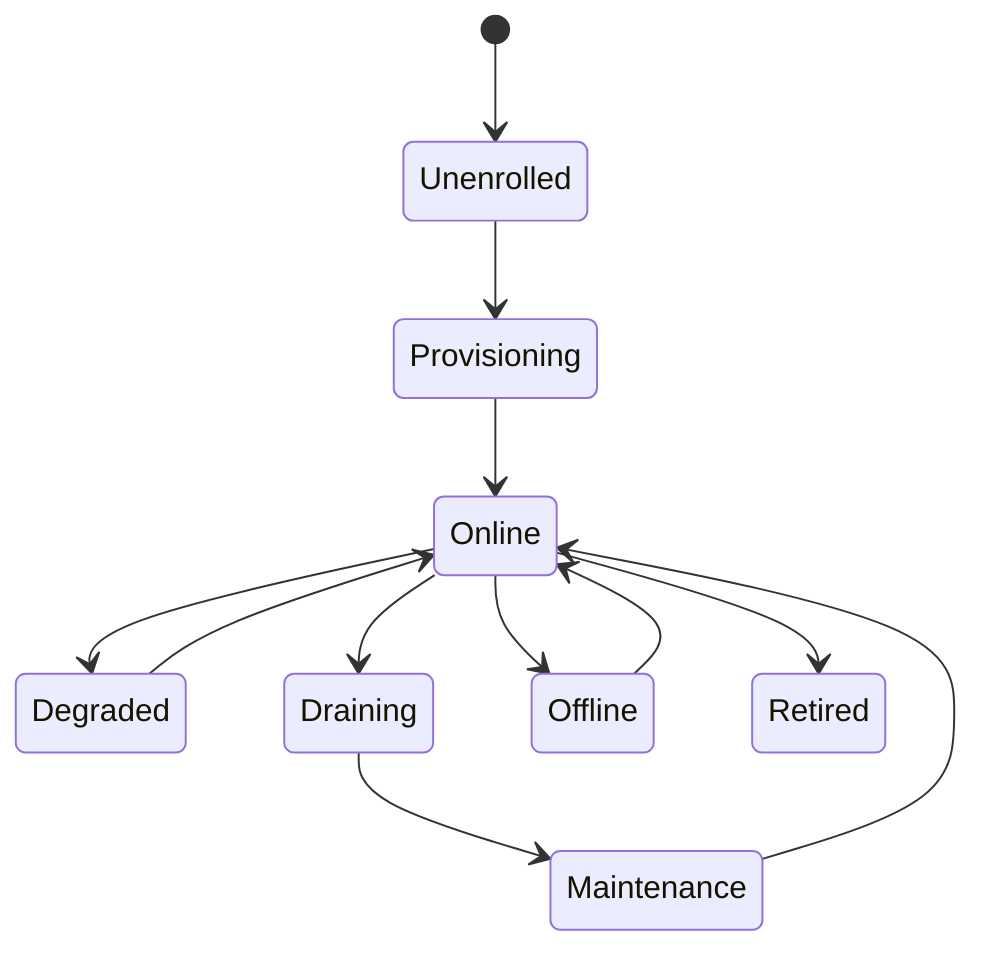

# 05. Node Agent and VPS Manager

## 5.1 Purpose

The node agent is the operational backbone for node onboarding, runtime hosting, telemetry, and governed remote management.

It is responsible for:

- secure enrollment
- runtime installation and supervision
- config fetch, validation, and apply
- health and capability reporting
- traffic counters and local telemetry
- remote operations execution
- log and diagnostics collection
- upgrade orchestration

## 5.2 Design Shift

The agent is not only a daemon.
In the refreshed design, it is also a host for:

- runtime adapters
- WASM-based edge plugins and logic modules
- optional eBPF-driven low-overhead telemetry probes
- local capability reporting
- optional provider-specific hooks that remain outside the core control plane

## 5.3 Packaging

Provide:

- static Go binary for Linux amd64 and arm64
- systemd service unit
- install shell script with prerequisite checks
- optional Docker mode for lab and test only
- RPM and DEB packages later
- all binaries signed with TUF (The Update Framework) and verifiable via embedded public key

## 5.4 Supported Platforms

### v1

- Ubuntu 22.04 and 24.04
- Debian 12
- optional AlmaLinux or Rocky if the team has operational familiarity

### v2

- additional Linux distros
- cloud-init image bake
- provider marketplace images

## 5.5 One-Click Install Flow

### Inputs

- bootstrap token
- control plane URL
- expected node name
- region and provider tags
- optional labels
- runtime channel
- requested runtime adapter

### Flow

1. operator creates bootstrap token in the panel
2. panel shows installation command
3. operator runs command on the node
4. installer verifies OS and prerequisites
5. agent binary and local config are installed
6. node enrolls with control plane
7. agent fetches certs, runtime manifest, and adapter selection
8. runtime package and adapter dependencies are installed
9. services start and capability manifest is published

## 5.6 Agent Runtime Model

Processes:

- `node-agent`
- one or more managed runtime services
- local metrics exporter or probes

Directories:

- `/etc/platform-agent/`
- `/var/lib/platform-agent/`
- `/var/log/platform-agent/`
- `/opt/platform-runtime/`
- `/opt/platform-adapters/`
- `/opt/platform-wasm-plugins/`
- `/var/lib/platform-agent/ebpf/`
- `/opt/platform-ebpf/`

State kept locally:

- node ID
- cert and trust bundle
- current and previous config version
- installed adapter versions
- command receipts
- local health snapshots
- capability manifest cache

## 5.7 Capability Manifest

Each node should publish a capability manifest such as:

- host OS and architecture
- installed runtime adapter
- loaded WASM edge plugins
- supported command classes
- eBPF telemetry probes available
- artifact signature status
- posture collection capabilities
- maintenance and restart semantics
- upgrade channel
- current health state

This allows the control plane to avoid pushing incompatible configs or commands.

eBPF probe compatibility requires:

- kernel version >= 5.15 recommended (BTF support)
- graceful degradation to userspace probes on older kernels
- probe profiles are versioned contracts, validated before rollout

## 5.8 Agent State Machine

## 5.9 Remote Command Model

Every command has:

- command ID
- node ID
- command family and type
- requested by
- created at
- timeout
- args
- approval requirement
- target runtime adapter
- status transitions
- stdout and stderr references
- exit code
- artifact link if generated

Allowed command classes:

- service lifecycle
- package update
- config apply
- diagnostics snapshot
- network baseline test
- disk usage report
- rotate material
- maintenance toggles

Not allowed:

- arbitrary shell by default in production
- unrestricted file reads
- unrestricted script upload
- secret dumping

## 5.10 Configuration Apply Strategy

Requirements:

- atomic writes
- syntax validation before swap
- rollback to previous known-good version
- service reload preferred over restart
- adapter-specific preflight checks
- post-apply health confirmation

Flow:

1. fetch bundle
2. verify signature and hash
3. verify adapter compatibility
4. unpack to staging
5. validate
6. swap active version
7. reload service
8. confirm health
9. report success or failure

## 5.11 Health and Metrics

Minimum metrics:

- cpu
- memory
- disk
- load
- network in and out
- packet loss estimate
- agent version
- runtime version
- adapter version
- active sessions
- traffic counters
- config version
- heartbeat latency

Health checks:

- service process alive
- control plane reachability
- runtime local port reachable
- disk headroom
- certificate expiry horizon
- adapter health

## 5.12 Drain and Maintenance

### Drain

- stop assigning new sessions
- allow active sessions to finish within grace period
- show drain progress and remaining blockers

### Maintenance

- disable new assignments
- annotate reason and window
- allow upgrade and restart actions

## 5.13 Upgrade Strategy

- semantic versions for agent and runtime adapters
- channels: stable, candidate, canary
- rollout by region, node group, or capability family
- agent binary self-update via TUF-verified manifest:
  1. query control plane for update manifest (version, URL, SHA-256, signature)
  2. download new binary to staging directory
  3. verify Ed25519 signature against embedded public key
  4. verify SHA-256 checksum
  5. atomic rename to replace current binary
  6. post-restart health check within 30 seconds
  7. automatic rollback to previous binary if health check fails
- automatic rollback if:
  - agent fails to reconnect
  - health remains red past threshold
  - adapter compatibility check fails
  - runtime validation fails

## 5.14 Agent API Surface

Modes:

- long polling over HTTPS for simplicity
- optional streaming mode later for real-time command dispatch

Endpoints should support:

- register
- renew cert
- heartbeat
- publish capability manifest
- fetch commands
- post command result
- fetch config
- post telemetry batch

## 5.15 Failure Scenarios

### Control plane unreachable

- continue last known good config
- exponential backoff
- local state becomes degraded
- store telemetry temporarily

### Bad config

- fail closed to previous good config
- mark node degraded
- emit incident alert

### Capability mismatch

- reject incompatible rollout
- report required adapter or runtime change

### Cert expired

- emergency rotation attempt
- maintenance lock after grace window

### Disk full

- refuse rollout
- rotate logs
- emit alert

## 5.16 Self-Healing Policy

Each node should be able to receive a remediation policy that defines:

- which failure classes are auto-remediable
- permitted actions by runtime adapter
- retry budget per window
- cooldown duration
- escalation threshold
- whether the node should quarantine on repeated failure

Policy scope should support:

- global default
- node group override
- runtime adapter override
- per-node temporary override

## 5.17 Local Recovery Ladder

The agent should execute local remediation through a bounded ladder:

1. verify health signal locally
2. retry cheap probe
3. reload local config or process
4. restart runtime adapter
5. restart agent-managed service
6. mark node degraded and request control-plane decision
7. drain or quarantine if directed

Rules:

- each step emits a structured remediation event
- the ladder must stop when retry budget is exhausted
- local actions must preserve last-known-good state where possible
- the agent must never run arbitrary repair scripts outside approved capability families

## 5.18 WASM and eBPF Runtime Safety Controls

Minimum controls:

- verify plugin and probe signatures before load
- enforce per-plugin CPU and memory quotas
- isolate plugin filesystem and network permissions
- block unapproved host syscalls or privileged operations
- support immediate disable and unload from control plane
- report load failures and runtime violations as auditable events
