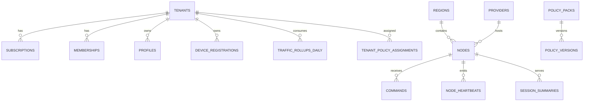

# 07. Data Model

## 7.1 Core Tables

### identities
- users
- user_sessions
- refresh_tokens
- mfa_methods
- passkey_credentials
- api_tokens

### tenancy
- tenants
- organizations
- memberships
- roles
- role_bindings
- feature_flags

### billing
- plans
- plan_versions
- subscriptions
- invoices
- invoice_items
- payment_events
- coupons
- credits
- usage_periods

### fleet
- providers
- regions
- node_groups
- nodes
- node_capabilities
- node_labels
- node_versions
- node_certificates
- node_maintenance_windows
- node_capacity_snapshots
- node_health_scores
- node_quarantine_events

### policy
- policy_packs
- policy_versions
- tenant_policy_assignments
- user_policy_overrides
- device_policy_overrides
- compiled_configs
- remediation_policies
- approval_policies
- simulation_runs

### access
- profiles
- profile_versions
- device_registrations
- credentials
- credential_rotations
- access_tokens
- access_requests
- access_reviews

### telemetry
- node_heartbeats
- traffic_rollups_hourly
- traffic_rollups_daily
- session_summaries
- latency_samples
- anomaly_events
- health_events
- remediation_signals

### ops
- commands
- command_results
- remediation_attempts
- remediation_actions
- incidents
- incident_events
- support_notes

### audit
- audit_logs
- webhook_deliveries
- export_jobs
- extension_sync_runs
- outbox_events

## 7.2 Important Entity Notes

### tenants
Fields:
- id
- slug
- name
- status
- owner_user_id
- billing_customer_ref
- plan_id
- timezone
- created_at
- updated_at

### subscriptions
Fields:
- id
- tenant_id
- plan_version_id
- billing_cycle
- status
- renews_at
- current_period_start
- current_period_end
- hard_cap_behavior
- source

### nodes
Fields:
- id
- name
- provider_id
- region_id
- status
- enrollment_status
- channel
- public_ip
- private_ip
- hostname
- os
- arch
- last_seen_at
- agent_version
- runtime_version
- runtime_adapter
- config_version
- cordoned
- draining
- maintenance_mode
- health_score
- quarantine_state
- labels_jsonb
- created_at
- updated_at

### compiled_configs
Fields:
- id
- scope_type
- scope_id
- config_hash
- version
- artifact_path
- generated_at
- generated_by

### commands
Fields:
- id
- node_id
- type
- args_jsonb
- status
- requested_by
- requested_at
- started_at
- finished_at
- timeout_seconds
- idempotency_key
- approval_state

### remediation_attempts
Fields:
- id
- node_id
- failure_class
- detected_at
- policy_id
- status
- retry_budget_window
- cooldown_until
- escalation_state
- initiated_by

### access_requests
Fields:
- id
- tenant_id
- requester_user_id
- target_type
- target_id
- request_reason
- requested_duration_seconds
- status
- required_reviews
- expires_at
- created_at

## 7.3 Indexing Strategy

Examples:
- `nodes(status, region_id, updated_at desc)`
- `nodes(quarantine_state, health_score, updated_at desc)`
- `node_heartbeats(node_id, observed_at desc)`
- `node_health_scores(node_id, observed_at desc)`
- `audit_logs(target_type, target_id, created_at desc)`
- `traffic_rollups_daily(tenant_id, day desc)`
- `session_summaries(tenant_id, started_at desc)`
- `remediation_attempts(node_id, detected_at desc)`
- `access_requests(tenant_id, status, created_at desc)`
- partial index on `subscriptions(status)` where active-ish
- partial index on `commands(status)` for pending/running

## 7.4 Partitioning

Partition by time for:
- audit_logs
- node_heartbeats
- node_health_scores
- latency_samples
- session_summaries
- webhook_deliveries
- remediation_attempts

Keep rollups separate from raw events.

## 7.5 Data Retention

Suggested defaults:
- raw heartbeats: 30 days
- raw latency samples: 14 days
- raw remediation signals: 30 days
- session summaries: 90 days
- audit logs: 1 year minimum
- billing artifacts: per compliance requirement
- diagnostics bundles: 7 to 30 days depending on sensitivity

## 7.6 Example ER Summary

