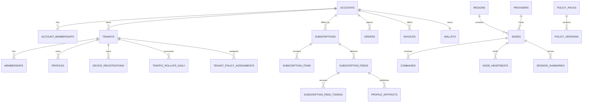

# 07. Data Model

## 7.1 Core Tables

### identities
- users
- user_sessions
- refresh_tokens
- mfa_methods
- passkey_credentials
- api_tokens

### tenancy
- accounts
- account_memberships
- tenants
- memberships
- roles
- role_bindings
- seat_allocations
- feature_flags

### billing
- catalog_products
- catalog_skus
- price_versions
- entitlement_templates
- subscriptions
- subscription_items
- orders
- order_items
- payment_intents
- payment_attempts
- payment_methods
- invoices
- invoice_items
- wallets
- credit_ledger
- coupons
- recharge_codes
- reseller_accounts
- reseller_wallet_ledger
- reseller_settlements
- usage_periods

### fleet
- providers
- regions
- node_groups
- nodes
- node_capabilities
- wasm_plugins
- node_wasm_plugin_installs
- ebpf_probe_profiles
- node_labels
- node_versions
- node_certificates
- node_maintenance_windows
- node_capacity_snapshots
- node_health_scores
- node_quarantine_events

### policy
- policy_packs
- policy_versions
- tenant_policy_assignments
- user_policy_overrides
- device_policy_overrides
- compiled_configs
- risk_policies
- remediation_policies
- approval_policies
- simulation_runs

### access
- profiles
- subscription_feeds
- subscription_feed_tokens
- profile_artifacts
- client_compat_manifests
- profile_versions
- device_registrations
- credentials
- credential_rotations
- access_tokens
- access_requests
- access_reviews

### telemetry
- node_heartbeats
- traffic_rollups_hourly
- traffic_rollups_daily
- session_summaries
- latency_samples
- anomaly_events
- health_events
- remediation_signals
- risk_events

### ops
- commands
- command_results
- remediation_attempts
- remediation_actions
- session_control_actions
- incidents
- incident_events
- support_notes

### audit
- audit_logs
- webhook_deliveries
- export_jobs
- extension_sync_runs
- outbox_events

## 7.2 Important Entity Notes

### accounts
Fields:
- id
- type (`individual | organization | reseller`)
- name
- status
- default_tenant_id
- billing_email
- price_tier
- tax_profile
- created_at
- updated_at

Notes:
- every commercial customer is an account
- an individual account auto-creates a personal tenant
- an organization account may own multiple tenants over time
- reseller accounts can own downstream customers but never other resellers

### account_memberships
Fields:
- id
- account_id
- user_id
- role_id
- invited_by
- joined_at
- expires_at

Notes:
- commercial access is modeled separately from tenant RBAC
- account roles include `account_owner`, `billing_admin`, `account_admin`, and `member`
- reseller roles include `reseller_owner`, `reseller_operator`, and `reseller_finance`

### tenants
Fields:
- id
- account_id
- slug
- name
- status
- owner_user_id
- timezone
- created_at
- updated_at

### subscriptions
Fields:
- id
- account_id
- tenant_id
- base_product_id
- billing_cycle
- status
- auto_renew
- renews_at
- current_period_start
- current_period_end
- hard_cap_behavior
- source

Notes:
- at most one base subscription may be active per account or tenant billing scope at a time
- add-ons are expressed through `subscription_items`
- traffic defaults to reset per billing period without carryover unless enabled by `price_versions`

### subscription_items
Fields:
- id
- subscription_id
- sku_id
- item_type
- quantity
- entitlement_snapshot
- period_start
- period_end

Supported `item_type` values:
- `base_subscription`
- `traffic_pack`
- `seat_pack`
- `device_pack`
- `region_pack`
- `connector_pack`
- `support_addon`

### price_versions
Fields:
- id
- sku_id
- currency
- billing_interval
- billing_interval_count
- tax_class
- visibility_scope
- sales_channel
- unit_amount
- reseller_unit_amount
- carryover_enabled
- effective_from
- effective_to

### wallets
Fields:
- id
- account_id
- currency
- balance_minor
- status
- created_at
- updated_at

### credit_ledger
Fields:
- id
- account_id
- wallet_id
- source_type
- delta_minor
- balance_after_minor
- order_id
- invoice_id
- created_at

### orders
Fields:
- id
- account_id
- tenant_id
- status
- currency
- subtotal_minor
- discount_minor
- credit_applied_minor
- wallet_applied_minor
- payable_minor
- payment_status
- created_at
- expires_at

States:
- `draft`
- `pending_payment`
- `paid`
- `activating`
- `active`
- `canceled`
- `expired`
- `refunded`

### payment_intents
Fields:
- id
- order_id
- channel
- status
- amount_minor
- external_ref
- requires_manual_confirmation
- created_at
- updated_at

Supported `channel` values:
- `stripe_card`
- `paypal`
- `crypto`
- `bank_transfer`
- `wallet_balance`
- `recharge_code`

### invoices
Fields:
- id
- account_id
- order_id
- subscription_id
- status
- currency
- subtotal_minor
- tax_minor
- total_minor
- issued_at
- due_at
- paid_at

States:
- `draft`
- `issued`
- `paid`
- `void`
- `refunded`
- `overdue`

### reseller_accounts
Fields:
- id
- reseller_account_id
- customer_account_id
- status
- pricing_policy
- settlement_term
- created_at
- updated_at

### recharge_codes
Fields:
- id
- reseller_account_id
- code
- currency
- face_value_minor
- status
- redeemed_by_account_id
- expires_at
- redeemed_at

### subscription_feeds
Fields:
- id
- subscription_id
- account_id
- tenant_id
- status
- label
- device_binding_mode
- expires_at
- last_published_at
- created_at

### subscription_feed_tokens
Fields:
- id
- feed_id
- token_hash
- status
- last_used_at
- rotated_from_token_id
- revoked_at
- expires_at

### profile_artifacts
Fields:
- id
- feed_id
- profile_id
- format
- etag
- artifact_path
- generated_at

### client_compat_manifests
Fields:
- id
- artifact_id
- client_family
- metadata_jsonb
- generated_at

### nodes
Fields:
- id
- name
- provider_id
- region_id
- status
- enrollment_status
- channel
- public_ip
- private_ip
- hostname
- os
- arch
- last_seen_at
- agent_version
- runtime_version
- runtime_adapter
- risk_tier
- config_version
- cordoned
- draining
- maintenance_mode
- health_score
- quarantine_state
- labels_jsonb
- created_at
- updated_at

### compiled_configs
Fields:
- id
- scope_type
- scope_id
- config_hash
- version
- artifact_path
- generated_at
- generated_by

### commands
Fields:
- id
- node_id
- type
- args_jsonb
- status
- requested_by
- requested_at
- started_at
- finished_at
- timeout_seconds
- idempotency_key
- approval_state

### remediation_attempts
Fields:
- id
- node_id
- failure_class
- detected_at
- policy_id
- status
- retry_budget_window
- cooldown_until
- escalation_state
- initiated_by
- detector_decision_ref

### node_wasm_plugin_installs
Fields:
- id
- node_id
- plugin_id
- plugin_version
- signature_status
- rollout_id
- status
- installed_at

### risk_events
Fields:
- id
- tenant_id
- subject_type
- subject_id
- risk_score
- risk_level
- source
- action_taken
- observed_at

### access_requests
Fields:
- id
- tenant_id
- requester_user_id
- target_type
- target_id
- request_reason
- requested_duration_seconds
- status
- required_reviews
- expires_at
- created_at

## 7.3 Indexing Strategy

Examples:
- `accounts(type, created_at desc)`
- `account_memberships(account_id, user_id)`
- `nodes(status, region_id, updated_at desc)`
- `nodes(quarantine_state, health_score, updated_at desc)`
- `node_heartbeats(node_id, observed_at desc)`
- `node_health_scores(node_id, observed_at desc)`
- `subscriptions(account_id, status, current_period_end desc)`
- `subscription_items(subscription_id, item_type)`
- `orders(account_id, created_at desc)`
- `payment_intents(order_id, status)`
- `invoices(account_id, status, issued_at desc)`
- `recharge_codes(reseller_account_id, status, expires_at desc)`
- `subscription_feed_tokens(feed_id, status)`
- `audit_logs(target_type, target_id, created_at desc)`
- `traffic_rollups_daily(tenant_id, day desc)`
- `session_summaries(tenant_id, started_at desc)`
- `remediation_attempts(node_id, detected_at desc)`
- `node_wasm_plugin_installs(node_id, installed_at desc)`
- `risk_events(tenant_id, observed_at desc)`
- `access_requests(tenant_id, status, created_at desc)`
- partial index on `subscriptions(status)` where active-ish
- partial index on `commands(status)` for pending/running

## 7.4 Partitioning

Partition by time for:
- audit_logs
- node_heartbeats
- node_health_scores
- latency_samples
- session_summaries
- webhook_deliveries
- remediation_attempts

Keep rollups separate from raw events.

## 7.5 Data Retention

Suggested defaults:
- raw heartbeats: 30 days
- raw latency samples: 14 days
- raw remediation signals: 30 days
- session summaries: 90 days
- audit logs: 1 year minimum
- billing artifacts: per compliance requirement
- diagnostics bundles: 7 to 30 days depending on sensitivity

## 7.6 Example ER Summary

